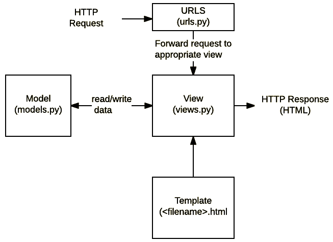

# What does Django code look like?

In a traditional data-driven website, a web application waits for HTTP requests from the web browser (or other client). When a request is received the application works out what is needed based on the URL and possibly information in **POST** data or **GET** data. Depending on what is required it may then read or write information from a database or perform other tasks required to satisfy the request. The application will then return a response to the web browser, often dynamically creating an HTML page for the browser to display by inserting the retrieved data into placeholders in an HTML template.

Django web applications typically group the code that handles each of these steps into separate files:

<!-- IMAGE
Caption: Django Structure
ID: django_structure
Alt text: 
Author: 
Attribution: 
Placeholder: TRUE  
--> 



<!-- END IMAGE -->

# Starting your Django app

Before we start, it is very useful to know that one Django project can have one or more applications (or apps). For example, if we create a Django project for a library, we can have a app called catalog, for the books; other app called HR, to manage the employees; another app called warehouse, for all the physical goods stored, such as chair, tables, and so on. 

For our first Django app, we will create a project with only one app. However, keep in mind that you can create as many apps as you need for your project. 

## Some basic commands used on the terminal:

- python manage.py startapp appname
- python manage.py runserver
- python manage.py migrate
- python manage.py makemigrations
- python manage.py sqlmigrate
- python manage.py showmigrations

You always can come back here, if you forget them.

## Django **startapp** command

As mentioned previewsly, a Django project can have more than one app. To create a app you need to create a folder with a particular structure by run the command bellow:

```
python manage.py startapp <yourappnamehere>
```

## Django **runserver** command

Everytime you want to run your Django application on your localhost you will need to run the command:

```
python manage.py runserver
```


## Django **migrations** command

Every time we change something on our Django's app, weneed to migrate. Migrations are Django’s way of propagating changes you make to our models, for example, to add a field, deleting a model, and soon. It is the only way the changes will be applied to our database schema. The command to Migrate your Django changes is: 

```
python manage.py migrate command
```

## Django **makemigrations** command

Afeter you run the migrations, you need to make the migrations accessible by using the command:

```
python manage.py makemigrations
```

It will make all the changes ...


Django framework have a very specific folder structure. We will learn about it as we create our Django app. 


<!-- IMAGE
Caption: Screen 1
ID: screen_1
Alt text: 
Author: 
Attribution: 
Placeholder: TRUE  
--> 


<!-- END IMAGE -->

