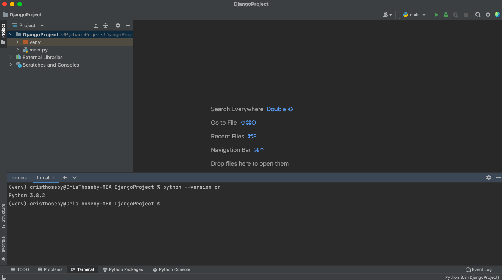
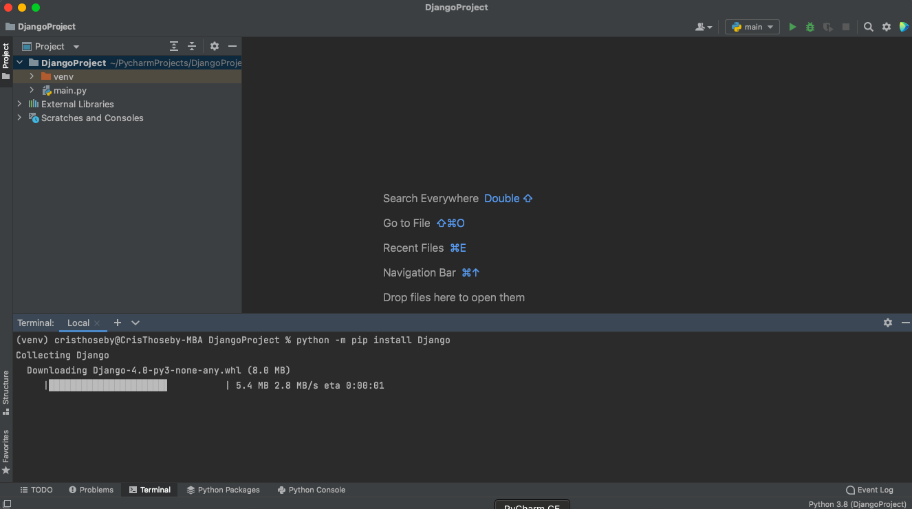
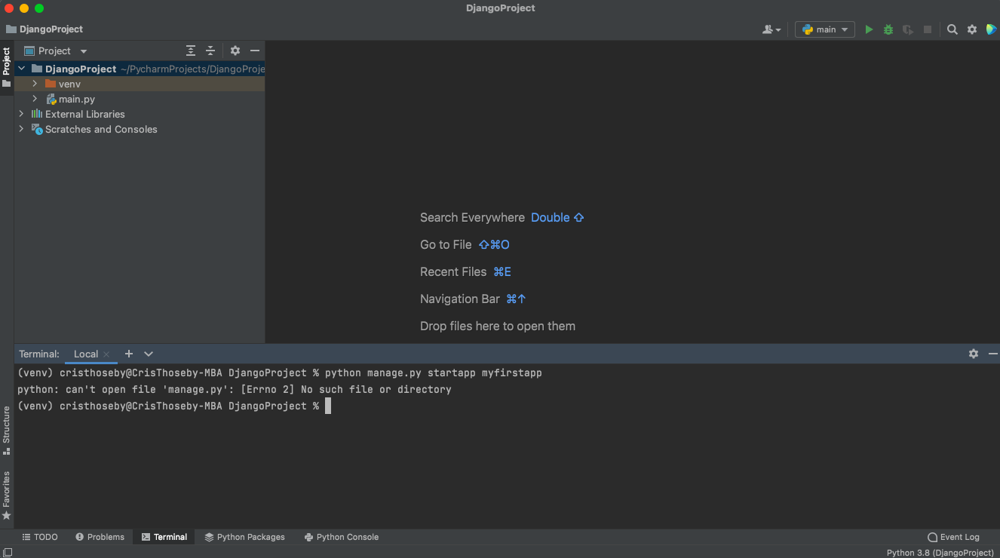
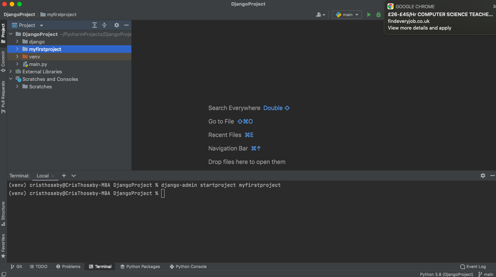

# Starting PyCharm

<!-- IMAGE
Caption: PyCharm1
ID: pycharm1
Alt text: 
Author: 
Attribution: 
Placeholder: TRUE  
--> 


<!-- END IMAGE -->

# Creating a new project

```
Creating the project
```
Open a command shell (or a terminal window), and make sure you are in your virtual environment.
Navigate to where you want to store your Django apps (make it somewhere easy to find like inside your Documents folder), and create a folder for your new website (in this case: django_projects).Then change into your newly-created directory:

```
mkdir django_projects
cd django_projects
```


<!-- IMAGE
Caption: PyCharm2
ID: pycharm2
Alt text: 
Author: 
Attribution: 
Placeholder: TRUE  
--> 


Create the new project using the django-admin startproject command as shown, and then change into the project folder:
django-admin startproject locallibrary

```
cd locallibrary
```


# Checking Python version


<!-- IMAGE
Caption: Checking Python Version
ID: pythonversioncheck
Alt text: 
Author: 
Attribution: 
Placeholder: TRUE  
--> 



# Installing Django

## from pip

<!-- IMAGE
Caption: Installing Django
ID: InstallingDjango1
Alt text: 
Author: 
Attribution: 
Placeholder: TRUE  
--> 



## from git clone

<!-- IMAGE
Caption: Installing Django
ID: InstallingDjango2
Alt text: 
Author: 
Attribution: 
Placeholder: TRUE  
--> 




# Creating your first app

Now that we have created a Django project environment, let's create our app. As previewsly mentioned, one project can have many apps. But for the purpose of this course we will create just one app.

<!-- IMAGE
Caption: Creating our first app
ID: createourfirstapp
Alt text: 
Author: 
Attribution: 
Placeholder: TRUE  
--> 


# My first project

<!-- IMAGE
Caption: Creating my first project
ID: firstproject
Alt text: 
Author: 
Attribution: 
Placeholder: TRUE  
--> 

