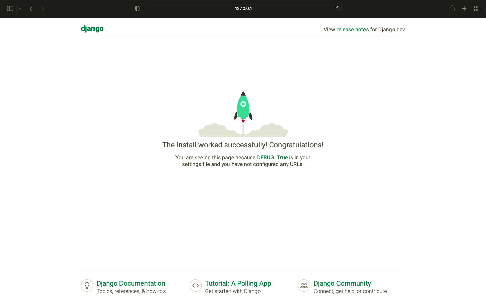

Django framework have a very specific folder structure. We will learn about it as we create our Django app. 

<!-- IMAGE
Caption: Screen 1
ID: screen_1
Alt text: 
Author: 
Attribution: 
Placeholder: TRUE  
--> 

<!-- END IMAGE -->

